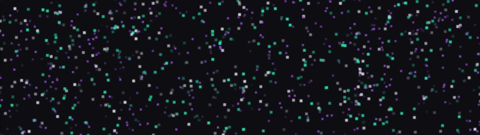

<!--
  ╔══════════════════════════════════════════════════════════════════════╗
  ║  Sirisha Kolluru — GitHub Profile README                            ║
  ║  Repo name: Siri-56  (matches your GitHub username)                ║
  ╚══════════════════════════════════════════════════════════════════════╝
-->

<!-- ═══════════════════ ANIMATED HERO ═══════════════════ -->

<!-- ═══════════════════ BADGES ROW ═══════════════════ -->

---

<!-- ═══════════════════ ABOUT ME ═══════════════════ -->
## 👩‍💻 About Me

*Aspiring Software & AI Engineer passionate about building intelligent, data-driven solutions that create real-world impact. I thrive at the intersection of **machine learning**, **NLP**, and **full-stack development**.*

| 🎓 Degree | 📍 Location | 💡 GPA | 📧 Contact |
|---|---|---|---|
| B.Tech CSE @ BML Munjal University | Gurugram, Haryana | 7.11 / 10.0 | sirisha.kolluru.23cse@bmu.edu.in |

<!-- ═══════════════════ TECH STACK ═══════════════════ -->

## 🛠️ Tech Stack

**💻 Programming Languages**

 

**🤖 AI / Data Science**

 

**🗄️ Databases & Tools**

# 

---

<!-- ═══════════════════ EDUCATION ═══════════════════ -->

## 🎓 Education

<table>
<tr>
<td width="50%" valign="top" align="center">

### 🏛️ BML Munjal University

&nbsp;

📍 Gurugram, Haryana

📊 **Cumulative GPA:** 7.11 / 10.0

🏫 School of Engineering & Technology

</td>
<td width="50%" valign="top" align="center">

### 📚 Gatik Junior College

&nbsp;

📍 Telangana

📊 **Percentage:** 91.9 / 100

🎯 Science Stream — MPC

</td>
</tr>
</table>

---

<!-- ═══════════════════ PROJECTS ═══════════════════ -->

## 🚀 Featured Projects

| 📁 Project | 🔧 Tech | 📝 Description |
|---|---|---|
| 🚗 **Autonomous Carbot** | Python, OpenCV, YOLO, TensorFlow Lite | Vision-based autonomous bot with **real-time object & lane detection**, adaptive speed control and obstacle avoidance |
| 🔍 **AI Facial Search System** | RetinaFace, ArcFace, FAISS, ONNX | End-to-end facial recognition pipeline — detect, align, embed. **Retrieve all photos of a person from a single selfie query** |

---

<!-- ═══════════════════ WORK EXPERIENCE ═══════════════════ -->

## 💼 Work Experience

**Data Scientist Intern — INNODATATICS** *(Jun 2025 – Jul 2025)*

- Built an AI-powered **Facebook intelligence monitoring system** with an end-to-end NLP pipeline
- Developed a **Facebook-based conversational interface** integrated with a live backend database
- Collaborated with academic & industry mentors on real-world production systems

---

<!-- ═══════════════════ CERTIFICATIONS ═══════════════════ -->

## 📜 Certifications

| 🏅 Certification | 🏛️ Issuer | 📅 Date |
|---|---|---|
| IBM Data Science | IBM / Coursera | 2024 |
| Google UX Design | Google / Coursera | 2024 |

---

<!-- ═══════════════════ ACHIEVEMENTS & LEADERSHIP ═══════════════════ -->

## 🏆 Achievements & Leadership

<table>
<tr>
<td width="50px" align="center">👑</td>
<td><strong>Vice President — Culinary Club, BML Munjal University</strong> Organized 10+ events over an academic year, leading a team end-to-end from planning to execution.</td>
</tr>
<tr>
<td align="center">⚔️</td>
<td><strong>Hackathon Participant</strong> Competed in university-level competitive programming and hackathon events, building solutions under pressure.</td>
</tr>
<tr>
<td align="center">🌍</td>
<td><strong>ClearSAR Worldwide Competition — 6th Place</strong> Ranked 6th globally in the ClearSAR international competition.</td>
</tr>
</table>

---

<!-- ═══════════════════ GITHUB STATS ═══════════════════ -->

## 📊 GitHub Stats

---

<!-- ═══════════════════ CONNECT ═══════════════════ -->

## 🌐 Connect With Me

<!--
  ════════════════════════════════════════════════
  ONE placeholder left:
  · YOUR_LEETCODE_USERNAME → your LeetCode handle
  ════════════════════════════════════════════════
-->
